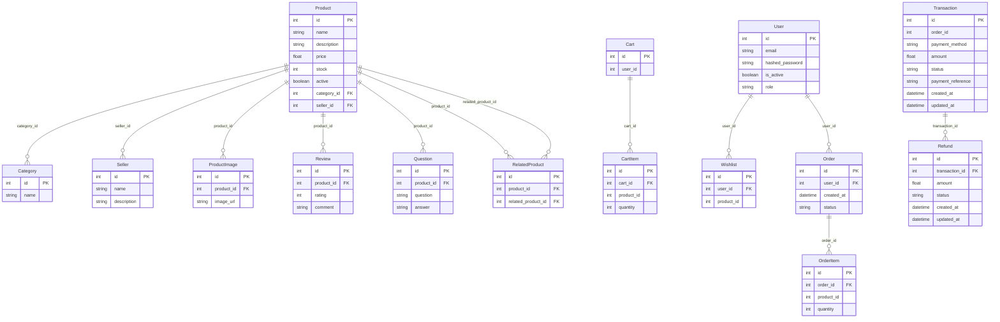

```mermaid
erDiagram
    Product ||--o{ Category : "category_id"
    Product ||--o{ Seller : "seller_id"
    Product ||--o{ ProductImage : "product_id"
    Product ||--o{ Review : "product_id"
    Product ||--o{ Question : "product_id"
    Product ||--o{ RelatedProduct : "product_id"
    RelatedProduct }o--|| Product : "related_product_id"
    Cart ||--o{ CartItem : "cart_id"
    User ||--o{ Wishlist : "user_id"
    User ||--o{ Order : "user_id"
    Order ||--o{ OrderItem : "order_id"
    Transaction ||--o{ Refund : "transaction_id"

    Product {
        int id PK
        string name
        string description
        float price
        int stock
        boolean active
        int category_id FK
        int seller_id FK
    }

    Category {
        int id PK
        string name
    }

    Seller {
        int id PK
        string name
        string description
    }

    ProductImage {
        int id PK
        int product_id FK
        string image_url
    }

    Review {
        int id PK
        int product_id FK
        int rating
        string comment
    }

    Question {
        int id PK
        int product_id FK
        string question
        string answer
    }

    RelatedProduct {
        int id PK
        int product_id FK
        int related_product_id FK
    }

    Cart {
        int id PK
        int user_id
    }

    CartItem {
        int id PK
        int cart_id FK
        int product_id
        int quantity
    }

    User {
        int id PK
        string email
        string hashed_password
        boolean is_active
        string role
    }

    Wishlist {
        int id PK
        int user_id FK
        int product_id
    }

    Order {
        int id PK
        int user_id FK
        datetime created_at
        string status
    }

    OrderItem {
        int id PK
        int order_id FK
        int product_id
        int quantity
    }

    Transaction {
        int id PK
        int order_id
        string payment_method
        float amount
        string status
        string payment_reference
        datetime created_at
        datetime updated_at
    }

    Refund {
        int id PK
        int transaction_id FK
        float amount
        string status
        datetime created_at
        datetime updated_at
    }
```